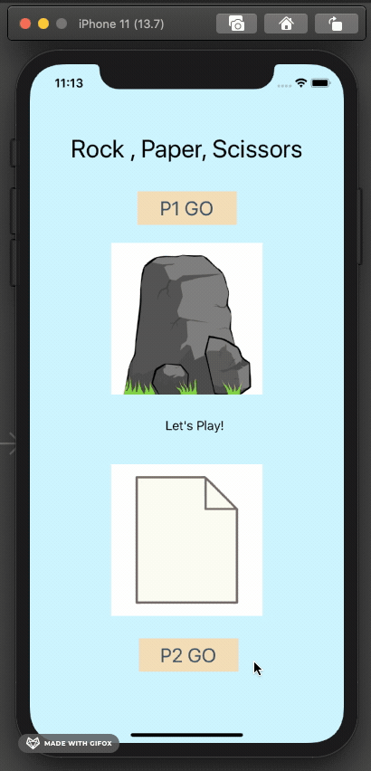

# Rock, Paper, Scissors App

## About the app

    Rock, paper, scissors game built with Swift using xCode.

## Rules of the game

    - 2 players
    - Rock beats scissors
    - Scissors beats paper
    - Paper beats rock
    - Each player will press the Go button, and the game will give them a randomized item : rock, paper or scissors
    - Once a player takes their turn, they are not able to take another turn until the other player has played and their Button changes from GO to WAITING
    - Players should be able to play again, as one player presses their GO button, the previous result should be removed until the other player plays and the new result is displayed

## App Preview

